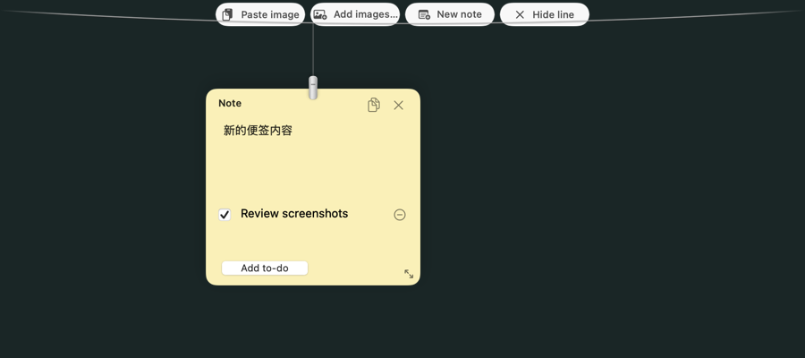

# Pinloom

Mantén imágenes, notas y tareas a la vista mientras trabajas. Aplicación nativa
para macOS 14 o posterior, en Apple silicon e Intel.

[English](../../README.md) · [简体中文](README.zh-Hans.md)



## Uso

Haz clic en el icono de chincheta de la barra de menús para mostrar u ocultar
la línea. Haz clic derecho para abrir el menú. Permanece visible hasta que la
ocultas, incluso sobre otras aplicaciones a pantalla completa.

- **Pegar imagen** añade una imagen del portapapeles.
- **Añadir imágenes…** abre el selector. También puedes arrastrar archivos a la línea o al icono.
- **Nueva nota** permite editar texto y añadir tareas con casillas. Todo se guarda localmente.
- Arrastra la pinza de una tarjeta para moverla y su esquina inferior derecha para cambiar el tamaño.
- Selecciona texto y usa **Command+C**, o **Copiar nota** para copiar la nota completa con sus tareas.
- Haz clic en una imagen para copiarla, doble clic para ampliarla o mantén pulsado para usar Marcación.
- Fija una imagen en una ventana independiente de referencia. Usa una copia propia que sobrevive a cambios del archivo original.

**Organizar** agrupa restablecer posiciones y descolgar imágenes; **Opciones**
agrupa sonidos y abrir al iniciar sesión. Recuperar una nota y mostrar u ocultar
referencias aparecen solo cuando son útiles. Ocultar la línea no elimina datos.
Descolgar conserva el archivo original; **Mover a la Papelera** lo elimina explícitamente.

No observa carpetas de capturas, cambia los ajustes de captura ni registra
atajos globales. Las imágenes añadidas permanecen hasta que las quitas.
El vídeo todavía no está disponible.

## Compilar

```sh
git clone https://github.com/z333d/pinloom.git
cd pinloom
swift test
swift scripts/check-strings.swift
SIGN_IDENTITY=- scripts/build-app.sh release
open build/Pinloom.app
```

Copia la aplicación a Aplicaciones. `scripts/make-dmg.sh` crea una imagen de
instalación sin abrir Finder. Las compilaciones locales y de CI tienen firma
ad hoc y no están notarizadas por Apple. Se requieren credenciales propias para
firmar con Developer ID y notarizar.

Pinloom usa su propio identificador y directorio de datos. En el primer inicio
copia imágenes, notas, posiciones y referencias de las primeras compilaciones
locales sin borrar los originales ni sobrescribir datos nuevos. Cierra la app
anterior antes de abrir Pinloom.

## Origen y licencia

Mantenido de forma independiente por [z333d](https://github.com/z333d), basado en
el código MIT de [Tendedero](https://github.com/alejandrobujan/tendedero) de Alejandro
Buján. Conserva los avisos originales y usa un nombre, icono e imágenes nuevos.
No es una versión oficial ni está respaldado por el autor original.
Consulta [LICENSE](../../LICENSE) y [NOTICE](../../NOTICE).
